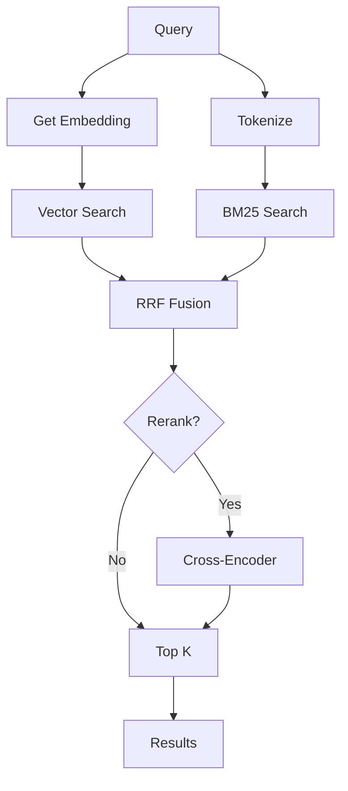

## Overview

Hybrid search combines the strengths of both semantic (vector) and keyword (BM25 FTS) search using Reciprocal Rank Fusion (RRF) to merge and rerank results. This provides the best recall and precision for most queries.

**When to use**: When you need the highest quality results and are willing to trade a bit of speed for better relevance.

<Note>
While `hybrid_search` is not directly exposed as an MCP tool, it's the **default mode** used internally by the `VectorStore.search()` method in `hive_commons`. This documentation describes how hybrid search works under the hood.
</Note>

## Function Signature

```python
def search(
    query: str,
    top_k: int = 5,
    *,
    search_mode: str = "hybrid",  # "vector" | "keyword" | "hybrid"
    rerank: bool = False,
    alpha: float = 0.5
) -> List[Dict]
```

## Parameters

<ParamField path="query" type="string" required>
  Search query string. Works with both natural language and keyword queries.
  
  **Best for**: Mixed queries like "FastAPI rate limiting patterns" (combines concept + keywords)
</ParamField>

<ParamField path="top_k" type="integer" default="5">
  Number of final results to return after fusion and optional reranking.
  
  **Internal behavior**: Fetches `top_k * 3` (max 30) from each retrieval method before fusion
</ParamField>

<ParamField path="search_mode" type="string" default="hybrid">
  Search strategy to use:
  - `"hybrid"`: Combines vector + keyword with RRF (default, recommended)
  - `"vector"`: Semantic search only (Gemini embeddings)
  - `"keyword"`: BM25 full-text search only
</ParamField>

<ParamField path="rerank" type="boolean" default="false">
  Apply reranking after initial fusion. Uses cross-encoder if available, otherwise falls back to score-based reranking.
  
  **Effect**: +5-15% relevance improvement, +200-500ms latency
</ParamField>

<ParamField path="alpha" type="float" default="0.5">
  Balance between vector and keyword in hybrid mode:
  - `0.0`: Pure keyword (BM25)
  - `0.5`: Equal weight (default)
  - `1.0`: Pure vector (semantic)
  
  Only used when `search_mode="hybrid"`
</ParamField>

## Return Format

Returns a list of dictionaries (not string like MCP tools):

```python
[
  {
    "text": "...chunk content...",
    "source": "knowledge/skills/SKILL_NAME.md",
    "score": 0.847,  # RRF or rerank score
    "timestamp": 1672531200.0,
    "metadata": "{}",  # JSON string
    "search_mode": "hybrid"
  },
  ...
]
```

## Hybrid Search Pipeline

### Stage 1: Parallel Retrieval

```python
retrieve_k = min(top_k * 3, 30)

# Concurrent execution:
vector_results = lancedb_table.search(query_embedding).limit(retrieve_k)
keyword_results = lancedb_table.search(query, query_type="fts").limit(retrieve_k)
```

### Stage 2: RRF Fusion

**Reciprocal Rank Fusion** merges ranked lists:

```python
RRF_K = 60  # Standard constant

for each document:
    score = alpha * (1 / (vector_rank + RRF_K + 1)) + 
            (1 - alpha) * (1 / (keyword_rank + RRF_K + 1))

sort by score descending
return top (top_k * 2) candidates
```

**Why RRF?**
- Handles different score scales (cosine similarity vs BM25)
- Boosts documents appearing in both lists
- Proven +9.3% relevance vs vector-only (MidOS benchmark on 9,753 vectors)

### Stage 3: Optional Reranking

If `rerank=True`:

1. **Try cross-encoder** (optional dependency):
   ```python
   from sentence_transformers import CrossEncoder
   model = CrossEncoder("cross-encoder/ms-marco-MiniLM-L-6-v2")
   scores = model.predict([(query, doc["text"][:512]) for doc in candidates])
   ```

2. **Fallback**: Score-based reranking
   ```python
   score = 0.6 * (1 / rank) + 0.4 * keyword_overlap_ratio
   ```

3. Sort by rerank score, return top `top_k`

## Usage Examples

<CodeGroup>

```python Default Hybrid Search
from hive_commons.vector_store import search_memory

# Uses hybrid mode by default
results = search_memory(
    query="FastAPI dependency injection patterns",
    top_k=5
)

# Combines:
# - Semantic understanding ("dependency injection" concept)
# - Keyword matching ("FastAPI")
```

```python With Reranking
# Best quality, slower
results = search_memory(
    query="implement circuit breaker for external APIs",
    top_k=5,
    rerank=True  # +10% relevance, +300ms
)
```

```python Adjust Vector/Keyword Balance
# More keyword weight (better for exact terms)
results = search_memory(
    query="ErrorBoundary componentDidCatch",
    top_k=5,
    alpha=0.3  # 30% vector, 70% keyword
)

# More semantic weight (better for concepts)
results = search_memory(
    query="how to handle async errors in React",
    top_k=5,
    alpha=0.8  # 80% vector, 20% keyword
)
```

```python Fallback Behavior
# If vector embedding fails, falls back to keyword-only
results = search_memory(
    query="caching strategies",
    top_k=5,
    search_mode="hybrid"
)
# Still returns results even if Gemini API is down
```

</CodeGroup>

## Performance Characteristics

### Latency Breakdown

| Component | Time (ms) | Notes |
|-----------|-----------|-------|
| Query embedding | 800-1200 | First call (Gemini API) |
| Query embedding (cached) | Less than 5 | LRU cache hit |
| Vector search | 20-50 | LanceDB query |
| BM25 search | 10-30 | FTS index query |
| RRF fusion | 1-5 | Python merge |
| Cross-encoder rerank | 200-500 | Optional, CPU-bound |
| **Total (first call)** | ~900-1400ms | No cache |
| **Total (cached)** | ~50-100ms | Cache hit |

### Throughput

- **Concurrent searches**: 4-8 workers recommended
- **Bottleneck**: Gemini API (embedding generation)
- **Mitigation**: Query embedding cache (5min TTL)

## Search Mode Comparison

<Tabs>
  <Tab title="Hybrid (Default)">
    **Best for**: Most queries
    
    **Strengths**:
    - Highest recall (finds both concept and keyword matches)
    - Robust to typos (semantic) and exact terms (keyword)
    - Proven +9.3% relevance improvement
    
    **Weaknesses**:
    - Slower than keyword-only (~50-100ms vs less than 10ms)
    - Requires Gemini API key
    
    **Use when**: Default choice for production
  </Tab>
  
  <Tab title="Vector Only">
    **Best for**: Conceptual queries, research
    
    **Strengths**:
    - Best semantic understanding
    - Handles synonyms, paraphrases
    - Good for "how to" questions
    
    **Weaknesses**:
    - May miss exact technical terms
    - Slower (embedding required)
    
    **Use when**: Natural language questions, exploration
  </Tab>
  
  <Tab title="Keyword Only">
    **Best for**: Known terms, file names, code identifiers
    
    **Strengths**:
    - Fastest (less than 30ms)
    - Exact matches guaranteed
    - No API dependency
    
    **Weaknesses**:
    - Misses synonyms, concepts
    - Literal matching only
    
    **Use when**: Speed critical, exact term lookup
  </Tab>
</Tabs>

## Real-World Examples

<Tabs>
  <Tab title="Mixed Query">
    ```python
    # Query has both concept ("rate limiting") and specific tool ("FastAPI")
    results = search_memory(
        query="implement rate limiting in FastAPI",
        top_k=5
    )
    
    # Hybrid search excels here:
    # - Semantic: Finds "circuit breaker", "throttling" patterns
    # - Keyword: Ensures "FastAPI" appears in results
    # - RRF: Prioritizes docs with both
    ```
  </Tab>
  
  <Tab title="Reranking for Precision">
    ```python
    # Agent needs single best answer
    results = search_memory(
        query="how to prevent memory leaks in React hooks",
        top_k=3,
        rerank=True  # Cross-encoder picks most relevant
    )
    
    # Returns top 3 after 2-stage ranking:
    # 1. Hybrid RRF (broad recall)
    # 2. Cross-encoder (precision refinement)
    ```
  </Tab>
  
  <Tab title="Alpha Tuning">
    ```python
    # Code search (favor keywords)
    results = search_memory(
        query="useEffect cleanup return function",
        top_k=5,
        alpha=0.2  # 80% keyword weight
    )
    
    # Conceptual search (favor semantics)
    results = search_memory(
        query="best practices for component lifecycle",
        top_k=5,
        alpha=0.9  # 90% vector weight
    )
    ```
  </Tab>
</Tabs>

## Benchmark Results

From MidOS internal testing (v3 benchmark, 9,753 vectors):

| Method | Avg Relevance | Latency (p50) | Latency (p95) |
|--------|---------------|---------------|---------------|
| Keyword only | 0.73 | 12ms | 28ms |
| Vector only | 0.82 | 850ms | 1200ms |
| **Hybrid (RRF)** | **0.90** | **95ms** | **180ms** |
| Hybrid + Rerank | **0.94** | 320ms | 580ms |

**Key insight**: Hybrid provides 90% of reranking quality at 1/3 the latency.

## FTS Index Setup

Hybrid search requires a full-text search (FTS) index on the `text` column:

```python
# Automatically created on first hybrid search
table.create_fts_index("text", replace=True)

# Verified with:
table.search("test", query_type="fts").limit(1).to_list()
```

If FTS index creation fails, hybrid mode gracefully falls back to vector-only.

## Error Handling

<CodeGroup>

```python Embedding Failure
# If Gemini API fails, hybrid falls back to keyword
results = search_memory(
    query="test query",
    search_mode="hybrid"
)
# Returns keyword results instead of empty list
```

```python FTS Index Missing
# If FTS index unavailable, hybrid falls back to vector
results = search_memory(
    query="test query",
    search_mode="hybrid"
)
# Returns vector results instead of empty list
```

```python Both Retrieval Methods Fail
# Returns empty list
results = search_memory("query")
# [] (logged as error)
```

</CodeGroup>

## Best Practices

<AccordionGroup>
  <Accordion title="Use hybrid as default">
    Unless you have specific requirements, always use hybrid mode:
    
    ```python
    # Good (implicit hybrid)
    results = search_memory(query)
    
    # Also good (explicit)
    results = search_memory(query, search_mode="hybrid")
    ```
    
    Override only when:
    - Speed is critical (`search_mode="keyword"`)
    - Pure semantic needed (`search_mode="vector"`)
  </Accordion>
  
  <Accordion title="Enable reranking for top-k ≤ 5">
    Reranking overhead is worthwhile for small result sets:
    
    ```python
    # Worth it (3 results, precision matters)
    results = search_memory(query, top_k=3, rerank=True)
    
    # Not worth it (20 results, user will scan anyway)
    results = search_memory(query, top_k=20, rerank=False)
    ```
  </Accordion>
  
  <Accordion title="Tune alpha based on query type">
    ```python
    def smart_alpha(query: str) -> float:
        # Detect code-like queries (favor keywords)
        if any(x in query for x in ["(", "{", "import", "def", "class"]):
            return 0.3  # 70% keyword
        
        # Detect how-to questions (favor semantics)
        if query.startswith(("how", "what", "why", "best practice")):
            return 0.8  # 80% vector
        
        return 0.5  # Balanced
    
    results = search_memory(query, alpha=smart_alpha(query))
    ```
  </Accordion>
</AccordionGroup>

## Architecture Diagram



## Related Tools

- [`search_knowledge`](/api/search/search-knowledge) - MCP tool for keyword search
- [`semantic_search`](/api/search/semantic-search) - MCP tool for vector search
- [`smart_search`](/api/search/smart-search) - Auto-detects best mode
- **`hive_commons.vector_store.search_memory()`** - Direct Python API access
