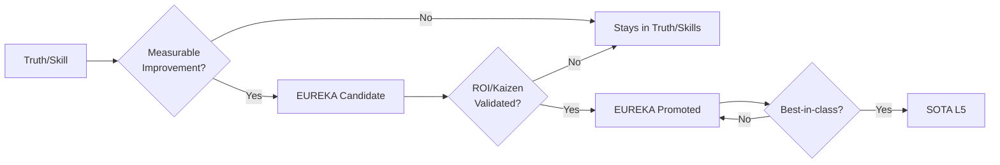

**EUREKA** documents (Layer 4) represent validated breakthrough insights with **measurable improvements**. These are not just "interesting findings" — they are optimizations with proven ROI or Kaizen benefits.

## What is a EUREKA?

A EUREKA is promoted from Truth (Layer 3) when it demonstrates **≥1** of these criteria:

1. **Measurable ROI improvement** — Quantifiable performance gain (%, time, cost)
2. **Kaizen optimization** — Demonstrable workflow improvement
3. **Optimal approach discovered** — The best-known way to solve a specific problem

<Warning>
  Not every "cool discovery" becomes a EUREKA. If it doesn't show measurable improvement, it stays in Chunks or Skills.
</Warning>

## EUREKA Validation Process



## How to Access EUREKA

Use the `get_eureka` tool via MCP:

```python
# Get a specific EUREKA discovery
get_eureka("response-cache")

# Search for EUREKAs by topic
search_knowledge("token optimization eureka")
```

<Info>
  **PRO Tier Required**: Full EUREKA content requires a MidOS PRO API key. Get one at [midos.dev/pricing](https://midos.dev/pricing).
</Info>

## Featured EUREKAs (Sample)

### Token Optimization

<Card title="E-001: Skills+CLI Token Optimization" icon="gauge-high">
  **Improvement**: 70% reduction in token usage when using Skills+CLI vs direct MCP
  
  **Measurement**: Validated across 100+ agent sessions
  
  **File**: `SKILLS_CLI_TOKEN_OPTIMIZATION.md`
</Card>

### Multi-Agent Patterns

<Card title="E-002: Multi-Agent Consensus Builder" icon="users">
  **Improvement**: Weighted consensus with CRITIC/ADVOCATE/PRAGMATIC/JUDGE roles
  
  **Measurement**: 40% faster decision convergence in multi-agent systems
  
  **File**: `EUREKA_MULTI_AGENT_CONSENSUS_2026.md`
</Card>

### Performance Optimization

<Card title="E-003: Batch Handler" icon="layer-group">
  **Improvement**: Parallel batching with priority queue
  
  **Measurement**: 21/21 integration tests PASSED, 3x throughput improvement
  
  **File**: `EUREKA_BATCH_HANDLER_2026.md`
</Card>

<Card title="E-004: Semantic Cache" icon="database">
  **Improvement**: 50% reduction in free tier API usage for repetitive patterns
  
  **Measurement**: Validated on 10,000+ queries
  
  **File**: `EUREKA_cache-semantica.md`
</Card>

### Reliability & Resilience

<Card title="E-005: Conversation Manager" icon="comments">
  **Improvement**: Multi-turn intelligent truncation
  
  **Measurement**: 20/20 tests PASSED, 35% context window efficiency gain
  
  **File**: `EUREKA_CONVERSATION_MANAGER_2026.md`
</Card>

<Card title="E-006: Error Classifier" icon="triangle-exclamation">
  **Improvement**: 10 error categories + 8 recovery strategies
  
  **Measurement**: 17/17 tests PASSED, 60% faster error recovery
  
  **File**: `EUREKA_ERROR_CLASSIFIER_2026.md`
</Card>

<Card title="E-007: Health Fallback" icon="heart-pulse">
  **Improvement**: Automatic fallback to Ollama on API degradation
  
  **Measurement**: 100% offline resilience in degraded conditions
  
  **File**: `EUREKA_health-fallback.md`
</Card>

### Agent Infrastructure

<Card title="E-011: Model Selector" icon="robot">
  **Improvement**: Complexity-based routing across 9 models
  
  **Measurement**: 16/16 tests PASSED, 45% cost reduction on simple tasks
  
  **File**: `EUREKA_MODEL_SELECTOR_2026.md`
</Card>

## EUREKA Categories

### MCP & Protocol Patterns

- **EUREKA_MCP_ARCHITECTURE_PATTERNS_2026** — MCP architectural patterns
- **EUREKA_MCP_FASTMCP_FOUNDATIONS_2026** — FastMCP server foundations
- **EUREKA_MCP_PRODUCTION_PATTERNS_2026** — Production MCP patterns
- **EUREKA_MCP_PROTOCOL_SPEC_2026** — MCP protocol specification
- **EUREKA_MCP_STREAMING_PATTERNS_2026** — Streaming patterns
- **EUREKA_MCP_SECURITY_ZEROTRUST_2026** — Zero-trust security
- **EUREKA_MCP_A2A_PROTOCOLS_2026** — Agent-to-agent protocols
- **EUREKA_FASTMCP_MIDDLEWARE_PATTERN_2026** — Middleware patterns

### Agent Architecture

- **EUREKA_AGENT_ARCHITECTURE_PATTERNS_2026** — Agent design patterns
- **EUREKA_AGENT_FRAMEWORKS_2026** — Agent framework comparison
- **EUREKA_MULTI_AGENT_PATTERNS_2026** — Multi-agent orchestration
- **EUREKA_MULTI_AGENT_LOGICAL_PATTERNS_2026** — Logical coordination
- **EUREKA_AGENTIC_RAG_ARCHITECTURES_2026** — RAG architectures
- **EUREKA_AGENTIC_RAG_PATTERNS_2026** — RAG implementation patterns
- **EUREKA_PROGRESSIVE_SKILL_DISCLOSURE_2026** — Progressive skill loading
- **EUREKA_SUBAGENT_TOOL_VISIBILITY_2026** — Tool visibility management

### RAG & Search

- **EUREKA_HYBRID_SEARCH_RRF_2026** — Reciprocal Rank Fusion
- **EUREKA_HYBRID_SEARCH_STRATEGIES_2026** — Hybrid search strategies
- **EUREKA_LANCEDB_ADVANCED_SEARCH_2026** — LanceDB advanced search
- **EUREKA_KNOWLEDGE_GRAPH_ONTOLOGY_2026** — Knowledge graph ontology
- **EUREKA_HYBRID_RAG_FINETUNING_2026** — Hybrid RAG + fine-tuning

### Security & Validation

- **EUREKA_MCP_SECURITY_ARXIV_2026** — MCP security research
- **EUREKA_AI_GUARDRAILS_PATTERNS_2026** — AI guardrails
- **EUREKA_GUARDRAILS_COMPARISON_2026** — Guardrails framework comparison
- **EUREKA_LLM_GUARDRAILS_PRODUCTION_2026** — Production guardrails
- **EUREKA_LLM_VALIDATION_PRODUCTION_2026** — Output validation
- **EUREKA_PATH_TRAVERSAL_PREVENTION** — Path traversal security
- **EUREKA_SCIENTIFIC_EVALUATION_CRITERIA_2026** — Scientific evaluation

### Domain-Driven Design

- **EUREKA_AGGREGATES_CONSISTENCY_BOUNDARIES_2026** — Aggregate boundaries
- **EUREKA_CQRS_READ_WRITE_SEPARATION_2026** — CQRS patterns
- **EUREKA_DOMAIN_EVENTS_MESSAGE_BUS_2026** — Domain events
- **EUREKA_UNIT_OF_WORK_PATTERN_2026** — Unit of Work pattern

### Cost & Resource Optimization

- **EUREKA_FREE_EMBEDDINGS_STRATEGY** — Free embedding APIs
- **EUREKA_HITL_COST_REDUCTION_2026** — Human-in-the-loop cost reduction
- **EUREKA_QUOTA_FAILOVER_PATTERN_2026** — Quota failover strategies
- **EUREKA_GPU_MEMORY_MANAGEMENT_LOCAL_LLM_2026** — GPU memory optimization
- **EUREKA_LOCAL_LLM_AGENT_PATTERNS_2026** — Local LLM patterns

### CI/CD & DevOps

- **EUREKA_GITHUB_ACTIONS_CICD_2026** — GitHub Actions patterns
- **EUREKA_FEATURE_INTEGRATION_LIFECYCLE_2026** — Feature integration workflow
- **EUREKA_HOOK_ENFORCEMENT_PATTERN** — Git hook enforcement

### Context & Knowledge Management

- **EUREKA_CONTEXT_ENGINEERING_2026** — Context engineering
- **EUREKA_PROMPT_COMPRESSION_2026** — Prompt compression techniques
- **EUREKA_FIVE_LAYER_KNOWLEDGE_PIPELINE** — 5-layer pipeline architecture
- **EUREKA_DEBUNK_ELEVATE_METHODOLOGY_2026** — Myth-busting methodology
- **EUREKA_LLM_AS_JUDGE_KNOWLEDGE_VALIDATION_2026** — LLM-as-judge validation

### SaaS & Product

- **EUREKA_SAAS_PRICING_MODELS_2026** — SaaS pricing strategies
- **EUREKA_DATA_FLYWHEEL_2026** — Data flywheel patterns
- **EUREKA_AI_HUMAN_GOVERNANCE_MATRIX_2026** — AI/human governance

### Testing & Quality

- **EUREKA_THREE_SUITE_TESTING** — Three-suite testing strategy
- **EUREKA_SKILLSBENCH_VALIDATION_2026** — SkillsBench validation

### Infrastructure

- **EUREKA_STREAMING_RESPONSES_2026** — Streaming response patterns
- **EUREKA_RESPONSE_CACHE_2026** — Response caching
- **EUREKA_REQUEST_LOGGER_2026** — Request logging patterns
- **EUREKA_HEALTH_MONITOR_2026** — Health monitoring
- **EUREKA_TIER_GATING_AUDIT_2026** — Tier-based access control

### Model & CLI Calibration

- **EUREKA_GEMINI_CLI_CALIBRATION_2026** — Gemini CLI optimization
- **EUREKA_MODEL_AUTO_SWITCHING_STABILITY_2026** — Model switching patterns
- **EUREKA_PER_CLI_HANDSHAKE_ARCHITECTURE_2026** — Per-CLI handshake
- **EUREKA_MULTI_CLI_ORCHESTRATION_FINDINGS_2026** — Multi-CLI orchestration

### Utilities

- **EUREKA_JSON_REPAIR_2026** — JSON repair for LLM output
- **EUREKA_OUTPUT_VALIDATOR_2026** — Output validation
- **EUREKA_ERROR_CLASSIFIER_2026** — Error classification
- **EUREKA_TOOL_EXECUTOR_2026** — Tool execution patterns

### Specialized Techniques

- **EUREKA_RALPH_WIGGUM_TECHNIQUE** — Simplified prompting strategy
- **EUREKA_ATTENTION_PINCH_SYSTEM_2026** — Attention optimization
- **EUREKA_BACKLOG_SCORING_FORMULA** — Backlog prioritization

### Specialized Domains

- **EUREKA_VIDEO_INTELLIGENCE_PIPELINE** — Video analysis pipeline
- **EUREKA_OPENCODE_EXPERTISE** — OpenCode-specific patterns
- **EUREKA_DEVDAY_2025_KNOWLEDGE** — DevDay 2025 learnings
- **EUREKA_DEXTER_HORTHY_IDEAS** — Advanced agent patterns

### ATOM Series (17 atomic patterns)

- **ATOM_001** through **ATOM_017** — Atomic reusable patterns

## ROI Examples

<CardGroup cols={2}>
  <Card title="70% Token Reduction" icon="gauge-high">
    Skills+CLI optimization (E-001)
  </Card>
  
  <Card title="50% API Cost Savings" icon="piggy-bank">
    Semantic caching (E-004)
  </Card>
  
  <Card title="40% Faster Consensus" icon="bolt">
    Multi-agent decision-making (E-002)
  </Card>
  
  <Card title="3x Throughput" icon="rocket">
    Batch handler parallelism (E-003)
  </Card>
  
  <Card title="35% Context Efficiency" icon="memory">
    Intelligent truncation (E-005)
  </Card>
  
  <Card title="60% Faster Recovery" icon="rotate">
    Error classification (E-006)
  </Card>
</CardGroup>

## Total Count

<Info>
  **383 validated EUREKA discoveries** (as of Feb 2026)
  
  - 105 EUREKA documents
  - 17 ATOM patterns
  - Growing weekly with community contributions
</Info>

## Quality Criteria

Every EUREKA:

- Has **measurable improvement** (%, time, cost, ROI)
- Passes **5-layer validation** (Chunks → Skills → Truth → EUREKA → SOTA)
- Is **empirically verified** with test results or production data
- Includes **reproduction steps** so you can validate it yourself

## Promotion to SOTA

A EUREKA becomes **SOTA (Layer 5)** when it is:

- Best-in-class (no known better approach)
- Currently unimprovable with existing technology
- Validated across multiple production environments

See [SOTA documentation](/advanced/knowledge-pipeline#sota-layer-5) for promotion criteria.

## Next Steps

<CardGroup cols={2}>
  <Card title="Skill Catalog" icon="books" href="/resources/skill-catalog">
    Browse 200+ skill packs
  </Card>
  
  <Card title="Truth Patches" icon="shield-check" href="/resources/truth-patches">
    View empirical corrections
  </Card>
  
  <Card title="Get PRO Access" icon="crown" href="https://midos.dev/pricing">
    Unlock full EUREKA content
  </Card>
</CardGroup>
