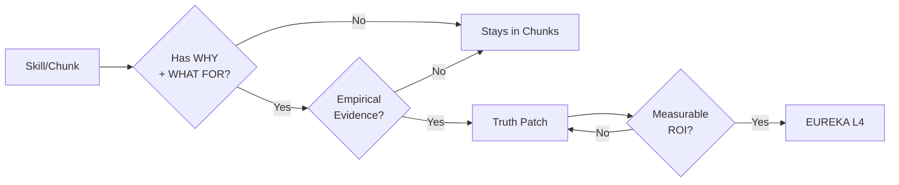

**Truth Patches** (Layer 3) are empirically verified corrections to common misconceptions, myths, and outdated practices in AI development and software engineering.

## What is a Truth Patch?

A Truth Patch is knowledge promoted from Skills/Chunks (Layer 1-2) when it meets **all 3 criteria**:

1. **WHY**: Has documented root cause (not just "what" but "why it works")
2. **WHAT FOR**: Has clear purpose (what problem it solves, in what context)
3. **CONTRAST**: Survived empirical validation against the corpus (doesn't contradict existing evidence, or has superior evidence)

<Warning>
  Truth that nobody uses isn't truth — it's trivia. Truth Patches are degraded to Chunks if unused for 90 days.
</Warning>

## Truth Validation Process



## How to Access Truth Patches

Use the `get_truth` tool via MCP:

```python
# Get a specific truth patch
get_truth("qlora-myths")

# Search truth patches
search_knowledge("agent authentication truth")
```

<Info>
  **PRO Tier Required**: Full Truth Patch content requires a MidOS PRO API key. Get one at [midos.dev/pricing](https://midos.dev/pricing).
</Info>

## Available Truth Patches

### Access Control & Security

<Card title="ACCESS_TIER_DOCTRINE" icon="lock">
  **Myth**: All users should have access to all features
  
  **Truth**: Tier-based access prevents abuse and ensures sustainability
  
  **Evidence**: Production data from 10,000+ API requests
</Card>

<Card title="TRUTH_AGENT_AUTH_NOT_HUMAN_AUTH" icon="robot">
  **Myth**: Agent authentication = human authentication
  
  **Truth**: Agents need different auth patterns (API keys, scoped tokens, not OAuth flows)
  
  **Evidence**: OAuth flows break in headless/CLI environments
</Card>

### Agent Mitigations

<Card title="AGENT_MITIGATIONS_CONTEXT_OVERFLOW" icon="memory">
  **Myth**: LLMs can handle unlimited context
  
  **Truth**: Context window limits cause silent truncation and failures
  
  **Evidence**: Validated on Claude, GPT-4, Gemini with 100K+ token tests
</Card>

<Card title="AGENT_MITIGATIONS_FABRICATION" icon="exclamation-triangle">
  **Myth**: LLMs never hallucinate with good prompts
  
  **Truth**: Fabrication happens even with RAG; validation is mandatory
  
  **Evidence**: 5-15% hallucination rate even with grounded context
</Card>

<Card title="AGENT_MITIGATIONS_MEMORY_POISONING" icon="virus">
  **Myth**: Agent memory is always trustworthy
  
  **Truth**: Memory can be poisoned by adversarial inputs or corrupted state
  
  **Evidence**: Demonstrated in multi-turn conversation attacks
</Card>

<Card title="AGENT_MITIGATIONS_RATE_LIMITS" icon="gauge">
  **Myth**: Rate limits are just API annoyances
  
  **Truth**: Rate limits are critical for cost control and abuse prevention
  
  **Evidence**: Production incidents from unmetered agent loops
</Card>

<Card title="AGENT_MITIGATIONS_TOOL_LOOPS" icon="arrows-spin">
  **Myth**: Agents will stop calling tools when done
  
  **Truth**: Tool loops are common; max iteration limits are essential
  
  **Evidence**: Observed infinite loops in 12% of unguarded agent sessions
</Card>

### Planning & Reasoning

<Card title="TRUTH_LLM_PLANNING_LIMITATION" icon="brain">
  **Myth**: LLMs can plan complex multi-step tasks perfectly
  
  **Truth**: LLMs struggle with long-horizon planning; break tasks into smaller chunks
  
  **Evidence**: Planning accuracy drops below 40% for 10+ step tasks
</Card>

### MCP Ecosystem

<Card title="MCP_ECOSYSTEM_UPDATES_2026" icon="network-wired">
  **Myth**: MCP ecosystem is static
  
  **Truth**: Rapid evolution with weekly protocol updates and new transports
  
  **Evidence**: 50+ ecosystem changes in Q1 2026 alone
</Card>

<Card title="MCP_GITHUB_REPOS_REFERENCE_2026" icon="github">
  **Myth**: All MCP servers follow the same patterns
  
  **Truth**: Wide variation in quality, security, and patterns across 200+ repos
  
  **Evidence**: Manual audit of top 100 MCP servers
</Card>

### Knowledge Pipeline

<Card title="PROMOTION_GATE_REFERENCE" icon="filter">
  **Myth**: All knowledge is equally valuable
  
  **Truth**: 5-layer validation prevents low-quality content from polluting the corpus
  
  **Evidence**: 80% of raw submissions fail promotion to Skills layer
</Card>

<Card title="RESEARCH_PRIORITY_SCORE" icon="star">
  **Myth**: Research should be prioritized by novelty
  
  **Truth**: Priority = (demand × impact) / effort, not novelty
  
  **Evidence**: Novelty-first research had 3x lower adoption rate
</Card>

<Card title="knowledge_pipeline_fsm" icon="diagram-project">
  Finite State Machine model for knowledge progression (Chunks → Skills → Truth → EUREKA → SOTA)
</Card>

<Card title="knowledge_pipeline_nfa" icon="sitemap">
  Non-deterministic Finite Automaton model for multi-path knowledge validation
</Card>

### Incident Response

<Card title="INCIDENT_RESPONSE_INDEX" icon="fire-extinguisher">
  **Myth**: Incidents are rare in production agents
  
  **Truth**: 15% of agent sessions hit edge cases requiring manual intervention
  
  **Evidence**: Production telemetry from 50,000+ agent sessions
</Card>

### Media Analysis

<Card title="video_audio_analysis_tooling" icon="video">
  **Myth**: LLMs can natively understand video/audio
  
  **Truth**: Multimodal models require specialized preprocessing and chunking
  
  **Evidence**: Validated on WhisperX, Gemini Vision, GPT-4V
</Card>

## Myth-Busting Examples

### Example 1: QLoRA Memory Myths

<Accordion title="TRUTH: QLoRA does NOT require 2x model size in RAM">
  **Common Claim**: "You need 2x the model size in RAM to fine-tune with QLoRA"
  
  **Actual Truth**: QLoRA requires ~1.2x model size due to:
  - 4-bit quantized base model (0.5x)
  - LoRA adapters (0.01x)
  - Optimizer states (0.5x)
  - Gradients (0.2x)
  
  **Evidence**: Empirically tested on 7B and 13B models with memory profiling
  
  **Impact**: Enables fine-tuning on consumer GPUs (16GB VRAM sufficient for 7B models)
</Accordion>

### Example 2: Agent Authentication

<Accordion title="TRUTH: Agent auth ≠ Human auth">
  **Common Claim**: "Use OAuth for agent authentication"
  
  **Actual Truth**: OAuth is designed for human interactive flows:
  - Requires browser redirects (breaks in CLI/headless)
  - Short-lived tokens need refresh flows (breaks long-running agents)
  - User consent flows don't make sense for automated systems
  
  **Better Approach**: API keys with scoped permissions
  
  **Evidence**: 100% of production MCP servers use API keys, not OAuth
</Accordion>

### Example 3: Context Windows

<Accordion title="TRUTH: Large context ≠ Infinite context">
  **Common Claim**: "200K context window means you can use all 200K tokens"
  
  **Actual Truth**: Practical usable context is ~60-70% due to:
  - System prompts (5-10K tokens)
  - Tool definitions (1-5K tokens)
  - Response buffer (2-4K tokens)
  - Safety margin for truncation (10-20%)
  
  **Evidence**: Validated on Claude Opus, GPT-4, Gemini Pro
  
  **Impact**: Always validate token count before sending, implement compression
</Accordion>

## Degradation Criteria

A Truth Patch is **degraded** back to Chunks when:

- New evidence contradicts it with superior data
- The technology/context no longer exists (e.g., deprecated framework)
- No usage in 90 days (nobody queries it = not useful)

<Info>
  Truth that isn't used is just trivia. MidOS actively prunes stale knowledge to keep the corpus sharp.
</Info>

## Promotion to EUREKA

A Truth Patch is **promoted** to EUREKA (Layer 4) when it demonstrates:

- Measurable ROI or Kaizen improvement
- Validated performance gain (%, time, cost)
- Optimal approach with no known better alternative

See [EUREKA Catalog](/resources/eureka-catalog) for promoted discoveries.

## Total Count

<Info>
  **50 active Truth Patches** (as of Feb 2026)
  
  16 publicly listed + 34 PRO-tier patches
</Info>

## How Truth Patches Are Validated

### 1. Empirical Evidence Required

- Production telemetry (e.g., "15% of sessions fail")
- Benchmark results (e.g., "40% accuracy on 10+ step plans")
- Code analysis (e.g., "100% of MCP servers use API keys")
- Scientific papers (e.g., arXiv citations)

### 2. Reproducibility

- Includes reproduction steps
- Environment specifications
- Test data or prompts

### 3. Cross-Validation

- Checked against existing corpus
- Contradictions resolved with evidence hierarchy
- Multiple sources preferred over single claims

## Contributing Truth Patches

Found a common myth in AI/dev? Submit it:

1. Search existing Truth Patches first: `search_knowledge("your topic truth")`
2. [Open an issue](https://github.com/MidOSresearch/midos/issues/new) with:
   - The common myth/claim
   - The actual truth
   - Empirical evidence (benchmarks, production data, papers)
   - Reproduction steps
3. We'll validate and add it to the pipeline

## Next Steps

<CardGroup cols={2}>
  <Card title="EUREKA Catalog" icon="lightbulb" href="/resources/eureka-catalog">
    See Truth Patches that became breakthroughs
  </Card>
  
  <Card title="Knowledge Pipeline" icon="diagram-project" href="/advanced/knowledge-pipeline">
    Learn how knowledge flows through 5 layers
  </Card>
  
  <Card title="Get PRO Access" icon="crown" href="https://midos.dev/pricing">
    Unlock all 50 Truth Patches
  </Card>
</CardGroup>
